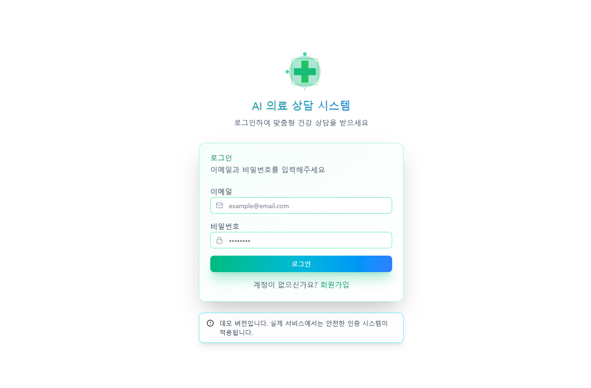
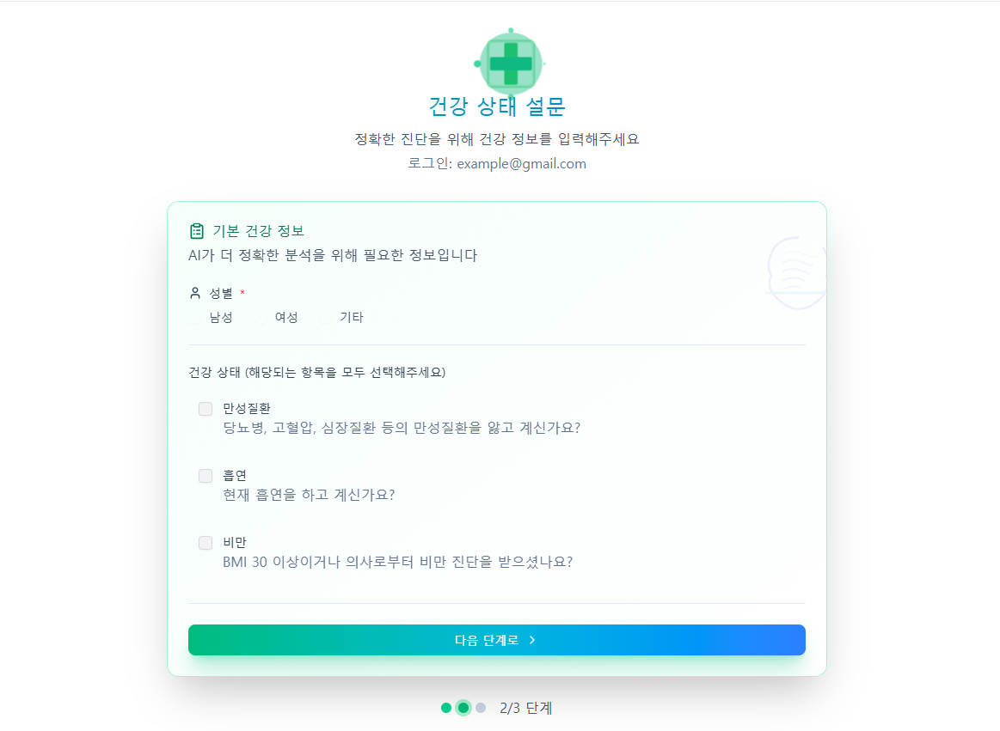
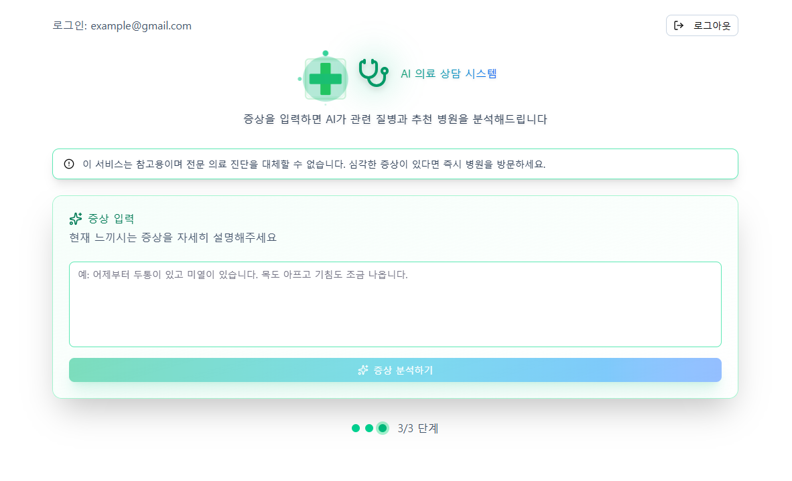
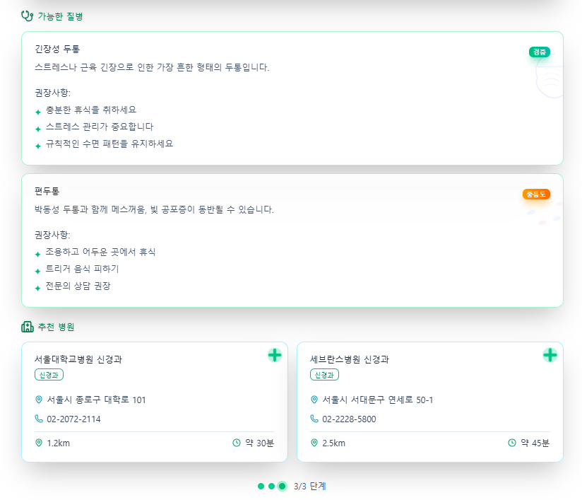

# 🏥 AI 기반 스마트 병원 추천 시스템


## 👥 팀원

<table align="center">
  <tr>
    <td align="center" valign="top">
      
      <br />
      <sub><b>황민우</b></sub>
      <br />
      <sub>팀장<br>
      안으로 들어가게 해주세요 제발.<br>
      제 딸이 데이터를 기다리고 있어요!
      </sub>
      <br />
      <a href="https://github.com/minwooHwang" target="_blank">minwooHwang</a>
    </td>
    <td align="center" valign="top">
      
      <br />
      <sub><b>손주영</b></sub>
      <br />
      <sub>부팀장<br>
      앞으로 가지마...<br>
      굉장히 많은 데이터가 있을거야.. 내예감알지?
      </sub>
      <br />
      <a href="https://github.com/sonjuyeong-00" target="_blank">sonjuyeong-00</a>
    </td>
    <td align="center" valign="top">
      
      <br />
      <sub><b>박세영</b></sub>
      <br />
      <sub>팀원<br>
      내가 구조대원이잖아요<br>
      다른사람은 몰라도 내가 알잖아요, 내가.
      </sub>
      <br />
      <a href="https://github.com/seyung000" target="_blank">seyung000</a>
    </td>
    <td align="center" valign="top">
      
      <br />
      <sub><b>장이건</b></sub>
      <br />
      <sub>팀원<br>
      엄마...가지마..<br>
      데이터 준다고 했잖아...
      </sub>
      <br />
      <a href="https://github.com/poolbbang" target="_blank">poolbbang</a>
    </td>
    <td align="center" valign="top">
      
      <br />
      <sub><b>김담하</b></sub>
      <br />
      <sub>팀원<br>
      나 아무렇지도 않다고!!<br>
      내 데이터 더 어딨어?
      </sub>
      <br />
      <a href="https://github.com/DamHA-Kim" target="_blank">DamHA-Kim</a>
    </td>
    <td align="center" valign="top">
      
      <br />
      <sub><b>조준호</b></sub>
      <br />
      <sub>팀원<br>
      48시간 지나서 프로젝트가 계속 없으면<br>
      여기서 내보내 줄거 같애?
      </sub>
      <br />
      <a href="https://github.com/lemondear" target="_blank">lemondear</a>
    </td>
  </tr>
</table>


## 🏥프로젝트 소개
**RAG 기반 LLM과 지능형 필터링을 활용한 맞춤형 병원 추천 플랫폼**

### 🎯 목적
사용자가 자신의 증상을 자연어로 입력하면, AI가 이를 정교하게 분석하여 질환의 가능성을 파악하고, 최적의 진료과 및 병원을 자동으로 추천해주는 지능형 의료 서비스 플랫폼입니다. 단순한 검색 기능을 넘어, 사용자의 표현 방식이나 질문 의도를 이해하고, 관련 의료 정보와 병원 데이터를 종합적으로 판단해 개인에게 가장 적합한 의료기관을 안내하는 스마트 헬스케어 솔루션입니다.

### 💎 핵심 가치
- **지능형 분석**: RAG 기술을 활용한 증상 분석 및 질환 예측
- **정확한 추천**: 다단계 필터링과 점수 모델을 통한 최적 병원 매칭
- **사용자 중심**: 위치, 진료과, 장비 등 다양한 조건을 고려한 맞춤형 추천
- **투명성**: AI가 왜 해당 병원을 추천했는지 명확한 설명 제공

### ✨ 주요 기능
- **🤖 AI 증상 분석**: LangChain + OpenAI 기반 자연어 증상 분석
- **🏥 스마트 병원 추천**: 진료과, 위치, 장비, 병원 등급을 고려한 지능형 추천
- **📊 점수 기반 순위화**: 다양한 요소를 종합한 병원 점수 산정
- **🗺️ 위치 기반 필터링**: 사용자 위치 기준 병원 검색
- **💬 자연어 대화**: 편리한 대화형 인터페이스
- **📈 상세 설명**: AI가 생성하는 추천 이유 및 근거 제공

## 🛠️ 기술 스택

### 백엔드
- **Framework**: Django 5.0+
- **Database**: PostgreSQL 15 + pgvector (벡터 검색)
- **ORM**: Django ORM
- **AI/ML**: LangChain, LangGraph, OpenAI API
- **Vector Store**: ChromaDB / pgvector
- **File Processing**: PyPDF2, python-docx

### AI/ML
- **LLM**: OpenAI GPT-4
- **RAG Framework**: LangChain
- **Workflow**: LangGraph (다단계 의사결정)
- **Vector DB**: pgvector (증상-질환 매칭)

### 인프라
- **Containerization**: Docker + Docker Compose
- **Database Management**: PostgreSQL
- **Development**: Hot reload, Auto-restart

## 🔄 시스템 아키텍처

```
사용자 질문 (자연어)
      ↓
[1] LLM → 분류 (과분류/답변 가능 여부 판단)
      ↓
[2] RAG → 증상 구체화 (의심 질환 후보 조회)
      ↓
[3] LLM → 상황 판단
    - 가장 가능성 높은 질환 선정
    - 중증도 판단
    - 최종 진료과 확정
      ↓
[4] RDB → 병원 필터링
    (1) 진료과 일치
    (2) 위치 제한 (사용자 시/구 기준)
    (3) 검사/치료에 필요한 장비 보유 여부
    (4) 병원 종별 조건 (상급 종합 필요 여부)
      ↓
[5] 점수 모델 → 병원 순위화
    병원 점수 = 진료과 일치 점수
              + 장비 가중치
              + 간호등급 점수
              + 병원 규모 점수
              - 거리 패널티
      ↓
[6] LLM → "왜 이 병원이 적합한지" 설명 생성
```


## 🌐 서비스 접속

| 서비스 | URL | 설명 |
|--------|-----|------|
| **Django 서버** | http://localhost:8000 | 메인 웹 애플리케이션 |
| **Admin 페이지** | http://localhost:8000/admin | Django 관리자 페이지 |
| **PostgreSQL** | localhost:5432 | 데이터베이스 서버 |

## 📁 프로젝트 구조

```
SKN18-4th-1team/
└── Feature_rag/                          # 메인 프로젝트 디렉토리
    ├── langgraph_structure/              # LangGraph 워크플로우 구현
    │   ├── nodes/                        # 워크플로우 노드 모듈
    │   ├── Ra─ classify_node.py          # [1단계] 질문 분류 노드
    │   │   ├── search_node.py            # 워크플로우 # [2단계]색 노드
    │   │   ├── rewrite_que               # 질문 재작성 노드
    │   |   ├── judgment_symtom.py        # [3단계] 증상 판단 노드
    │   │   ├── search_node.py            # [4단계] 병원 검색 노드
    │   │   ├── eval_node.pyml            # 컨테이너 노드
    │   │   ├── generation_llm.py         # 립트 최종 답변 생성 노드
    │   │   ├── memory_node.py            # 대화 기록 관리 노드
    │   main.ag/                          # RAG 시스템 구현
    │   │   ├── custom_ingest.py          # 문서 수집 및 전처리
    │   │   ├── custom_loader.py          # 커스텀 문서 로더
    │   │   ├── custom_pgvector.py        # pgvector 연동 모듈
    │   │   └── ingest_doc.py             # 프로젝트  # 문서 벡터화 및 저장
    ph.py                                 # LangGraph 워크플로우 정의
    │   ├── init_state.py                 # 상태 초기화 및 관리
    │   ├── utils.py                      # 공통 유틸리티 함수
    │   └── __init__.py                   # 패키지 초기화
    │
    ├── Docker_medical/                   # Docker 환경 설정
    │   ├── docker-compose.yml            # PostgreSQL + pgvector 컨테이너
    │   └── init.sql                      # 데이터베이스 초기화 스크립트
    │
    ├── Data/                             # 학습 및 참조 데이터
    │   └── .gitkeep                      # 디렉토리 유지용
    │
    ├── .venv/                            # Python 가상환경 (자동 생성)
    ├── .langgraph_api/                   # LangGraph API 캐시 (자동 생성)
    │
    ├── main.py                           # Django 서버 실행 진입점
    ├── insert_hospital.py                # 병원 데이터 벡터 DB 적재
    ├── requirements.txt                  # Python 의존성 패키지 목록
    ├── pyproject.toml                    # 프로젝트 메타데이터
    ├── langgraph.json                    # LangGraph 설정 파일
    ├── .env.sample                       # 환경 변수 템플릿
    ├── .env                              # 환경 변수 (Git 제외)
    ├── .gitignore                        # Git 제외 파일 목록
  README                                  # 프로젝트 문서
```

### 📂 주요 디렉토리 설명

#### `langgraph_structure/nodes/`
각 노드는 워크플로우의 특정 단계를 담당합니다:
- **classify_node.py**: 사용자 질문이 의료 관련인지 판단
- **search_node.py**: 벡터 DB에서 유사 증상 검색
- **judgment_symtom.py**: 증상 분석 및 질환 예측
- **search_hospital.py**: 조건에 맞는 병원 필터링
- **eval_node.py**: 사용자의 질문이 RAG에서 검색이 잘 되는지 판단
- **generation_llm.py**: 최종 추천 설명 생성
- **memory_node.py**: 대화 컨텍스트 유지

#### `langgraph_structure/Rag/`
RAG 시스템의 핵심 구현:
- **custom_ingest.py**: 의료 문서 수집 및 청크 분할
- **custom_loader.py**: 다양한 형식의 문서 로드
- **custom_pgvector.py**: PostgreSQL pgvector 연동
- **ingest_doc.py**: 문서를 벡터화하여 DB에 저장

#### `Docker_medical/`
개발 환경 구성:
- **docker-compose.yml**: PostgreSQL 15 + pgvector 확장
- **init.sql**: 병원 테이블, 진료과, 장비 등 스키마 정의

## 🔧 주요 컴포넌트

### LangGraph 워크플로우 상세
#랭그래프 사진 들어갈 자리

#### 1️⃣ 질문 분류 단계 (`classify_node.py`)
```python
입력: 사용자 질문
처리: LLM이 질문의 의료 관련성 판단
출력: "의료 질문" or "일반 질문"
```

#### 2️⃣ RAG 검색 단계 (`search_node.py`)
```python
입력: 의료 관련 질문
처리: 
  - 질문을 벡터로 임베딩
  - pgvector에서 유사 증상 검색
  - 관련 질환 후보 추출
출력: 유사 증상 리스트 + 질환 후보
```

#### 3️⃣ 증상 판단 단계 (`judgment_symtom.py`)
```python
입력: 증상 + 질환 후보
처리:
  - LLM이 가장 가능성 높은 질환 선정
  - 중증도 판단 (경증/중등도/중증)
  - 필요한 진료과 결정
  - 필요한 검사/장비 파악
출력: 질환명, 진료과, 중증도, 필요 장비
```

#### 4️⃣ 병원 검색 단계 (`search_hospital.py`)
```python
입력: 진료과, 위치, 필요 장비
처리:
  - PostgreSQL에서 조건 필터링
    ✓ 진료과 일치
    ✓ 사용자 위
## 🛡️ 보안 내
    ✓ 필요 장비 보유
    ✓ 병원 등급 (상급종합/종합/병원)
출력: 조건에 맞는 병원 리스트
```

#### 5️⃣ 병원 평가 단계 (`eval_node.py`)
```python
입력: 병원 리스트
처리: 점수 계산
  점수 = (진료과 일치도 × 30)
       + (장비 보유도 × 25)
       + (간호등급 × 20)
       + (병원 규모 × 15)
       - (거리 패널티 × 10)
출력: 점수순 정렬된 병원 리스트 (Top 5)
```

#### 6️⃣ 답변 생성 단계 (`generation_llm.py`)
```python
입력: 추천 병원 리스트 + 분석 결과
처리: LLM이 자연어로 설명 생성
  - 증상 요약
  - 예상 질환 설명
  - 각 병원 추천 이유
  - 주의사항 및 조언
출력: 사용자 친화적인 최종 답변
```

### 데이터베이스 스키마

#### 병원 정보 테이블 (hospitals)
```sql
- id: 병원 고유 ID
- name: 병원명
- address: 주소
- city: 시/도
- district: 구/군
- hospital_type: 병원 종별 (상급종합/종합/병원)
- nursing_grade: 간호등급 (1~7등급)
```

#### 진료과 테이블 (departments)
```sql
- id: 진료과 ID
- hospital_id: 병원 ID (FK)
- department_name: 진료과명
- doctor_count: 의사 수
```

#### 장비 테이블 (equipments)
```sql
- id: 장비 ID
- hospital_id: 병원 ID (FK)
- equipment_name: 장비명 (MRI, CT, 초음파 등)
- equipment_count: 보유 수량
```

#### 벡터 데이터 (pgvector)
```sql
- id: 문서 ID
- content: 증상/질환 설명 텍스트
- embedding: 벡터 임베딩 (1536차원)
- metadata: 질환명, 진료과 등 메타데이터
```

#### 데이터 출처
```
질병 및 증상 데이터 : https://www.aihub.or.kr/  (AIhub 전문 의학지식 데이터)
국내 병원 상세 정보 : https://www.data.go.kr/   (건강보험심사평가원_의료기관별상세정보서비스)
```

### 화면 설계 및 실행
<table>
<tr>
<td></td>
<td></td>
</tr>
<tr>
<td></td>
<td></td>
</tr>
</table>


### API 키 관리
- **환경 변수**: .env 파일로 민감 정보 관리
- **Git 제외**: .gitignore에 .env 파일 등록
- **샘플 제공**: .env.sample로 필요한 키 목록 제공

### 데이터 보호
- **SQL 인젝션 방지**: Django ORM 사용
- **입력 검증**: 사용자 입력 검증 및 필터링

## 🛠️ 문제 해결

### 자주 발생하는 문제

1. **PostgreSQL 연결 실패**
   ```bash
   cd Docker_medical
   docker-compose down -v
   docker-compose up -d
   ```

2. **OpenAI API 오류**
   - .env 파일에 올바른 API 키가 설정되어 있는지 확인
   - API 사용량 한도 확인

3. **벡터 DB 초기화 실패**
   ```bash
   python insert_hospital.py
   ```

4. **포트 충돌**
   - 8000, 5432 포트가 이미 사용 중인지 확인
   - docker-compose.yml에서 포트 변경 가능

### 로그 확인

```bash
# Django 서버 로그
python main.py

# Docker 컨테이너 로그
docker-compose logs -f
```

## 📊 데이터 적재

### Vector DB 초기화
```bash
# 증상-질환 데이터를 벡터 DB에 적재
python insert_hospital.py
```

이 스크립트는 다음을 수행합니다:
- 의료 지식 데이터를 벡터화
- PostgreSQL pgvector에 저장
- 증상 기반 검색을 위한 인덱스 생성

## 🔧 개발 가이드

### 브랜치 전략
- `main`: 프로덕션 브랜치
- `develop`: 개발 브랜치
- `feature/*`: 기능 개발 브랜치
- `fix/*`: 버그 수정 브랜치

### 커밋 컨벤션
```
feat: 새로운 기능 추가
fix: 버그 수정
docs: 문서 수정
style: 코드 포맷팅
refactor: 코드 리팩토링
test: 테스트 코드
chore: 빌드 업무 수정
```

## 📄 라이선스

이 프로젝트는 교육용 목적으로 개발되었습니다.

## 📞 문의

프로젝트에 대한 문의사항이 있으시면 이슈를 등록해주세요.

---
**SK Networks AI Camp 18기 4차 단위프로젝트 1팀** © 2025
