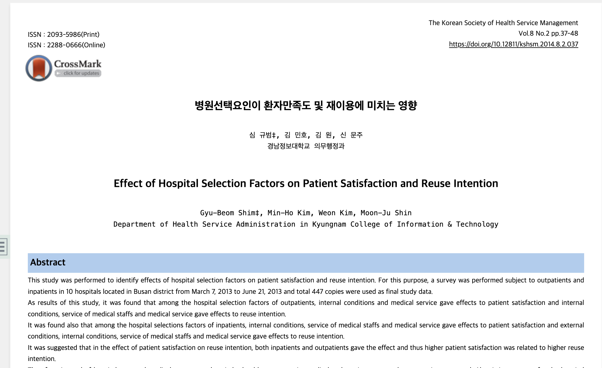
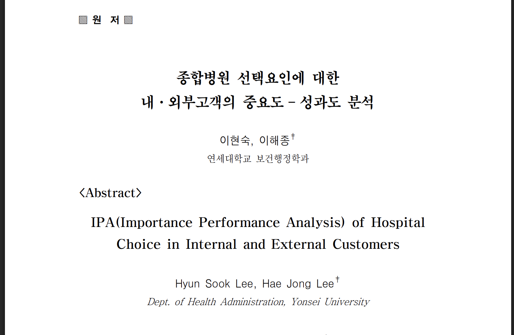
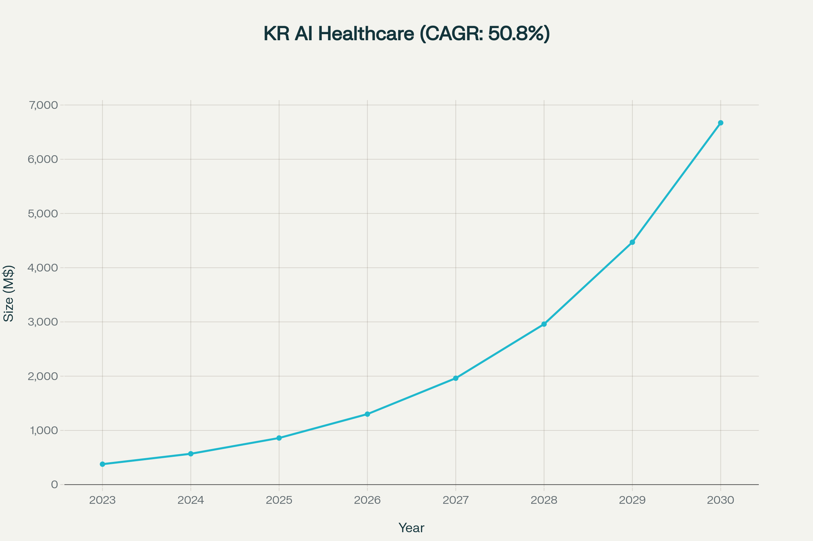
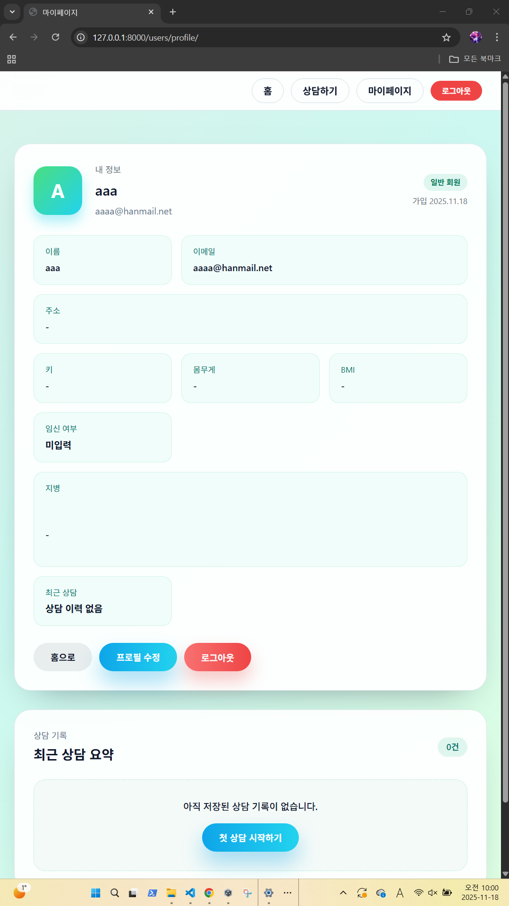
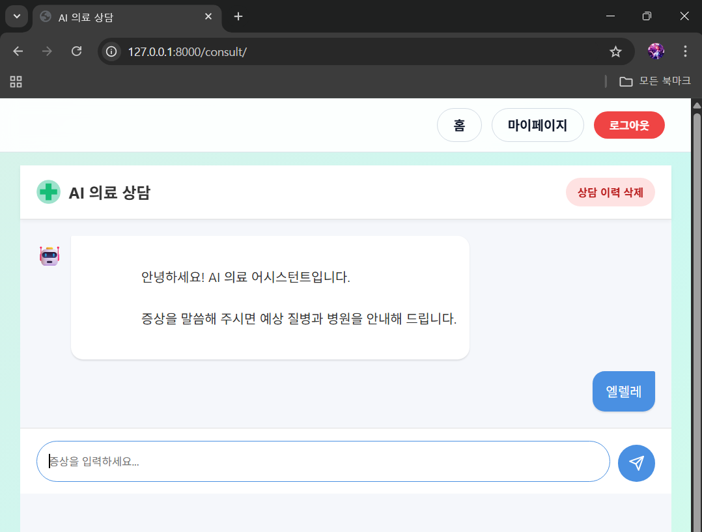
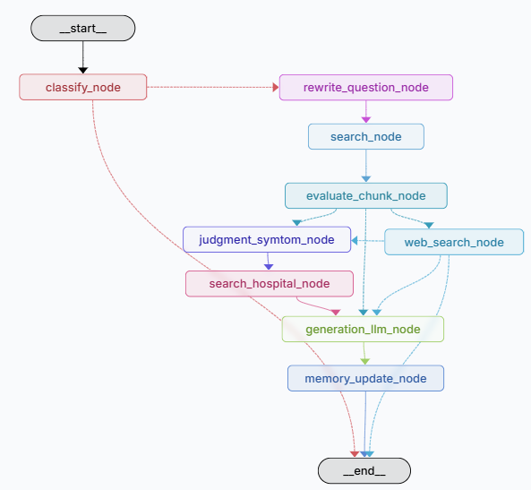

  

# 병원어때[의료 RAG 시스템 (Medical RAG System)]

LangGraph 기반의 의료 정보 검색 및 병원 추천 시스템입니다. 사용자의 증상을 분석하고, 관련 의료 정보를 제공하며, 적절한 병원을 추천합니다.

## 📋 목차
- [개요](#개요)
- [시장성](#시장성)
- [시스템 구조](#시스템-구조)
- [화면 설계서](#화면-설계서)
- [주요 기능](#주요-기능)
- [시스템 구조](#시스템-구조)
- [설치 방법](#설치-방법)
- [환경 설정](#환경-설정)
- [데이터베이스 설정](#데이터베이스-설정)
- [LangSmith를 사용한 테스트 및 모니터링](#langsmith를-사용한-테스트-및-모니터링)
- [프로젝트 구조](#프로젝트-구조)
- [기술 스택](#기술-스택)
- [병원 추천 알고리즘](#병원-추천-알고리즘)  
- [팀 소감](#팀-소감)  

## 개요  
우리가 어떠한 물건을 산다고 생각해봅시다. 같은 물건이라도 최저가에 배송비가 붙지 않는 곳에서 구매하기 위해 소비자들은 시간을 들여  
검색하고 찾아본 뒤에 본인이 찾은 정보 내에서 가장 합리적이라고 생각되는 곳에서 물건을 구매합니다.  

그런데 병원은 어떨까요? 생각보다 병원을 고르는 행위는 합리적인 선택과는 거리가 멀 수도 있다는 생각이 들었습니다. 당장 내가 아프니까, 혹은 어느 병원이 정말 좋은 병원인지 판단할 만 정보가 너무 부족하기 때문에 눈 앞에 당장 보이는 병원 혹은, 네이버 지도나 카카오지도에 검색해 나오는 가장 가까운 병원 중 하나를 선택해서 가는 경우가 대부분일 것 입니다.

저희는 바로 이 점에서 의문이 들었습니다. 왜 병원은 우리가 물건 사듯 재고 따지기가 어려운가? 굳이 이유를 찾자면 병원은 일반 상품과는 다르게 전문화된 상품이라는 것과 그것을 판별할만한 여유나 정보가 부족하기 때문일 것이고 저와 저희 팀은 바로 이 점을 해결해줄 수 있는 제품을 만들어보고자 했습니다.

   

## 시장성
  
2023~2030년 한국 AI 헬스케어 시장 성장 추이  
2023년: 3억 7,700만 달러 / 2030년: 66억 7,200만 달러(연평균 성장률 50.8%)  

- AI 헬스케어 및 의료 챗봇, 지능형 의료 내비게이션 시장은 연평균 20% 이상의 높은 성장세  

- 한국 내에서도 병원 예약, 의료 기관 검색, 증상 기반 진단 등 다양한 디지털 헬스케어 솔루션이 활발하게 도입, 상용화되고 있음  

- ZnanyLekarz(폴란드): 전국의 병원·의사 정보를 종합 제공, 후기 및 평점 기반으로 환자가 병원 선택  

- Babylon Health(영국): AI 챗봇 활용, 증상 분석과 전문가 매칭을 자동화해 효율과 신뢰성을 크게 향상  

**이를 통해 환자 증상 기반 맞춤 병원 추천 서비스에 대한 시장성은 충분히 확보되어있다는 것을 알 수 있습니다.**

## 화면 설계서
<table>
<tr>
<td style="text-align: center;">
  <br>
  건강상태 설문
</td>
<td style="text-align: center;">
  <br>
  여성의 경우 건강 설문
</td>
</tr>
<tr>
<td style="text-align: center;">
  <br>
  마이 페이지
</td>
<td style="text-align: center;">
  <br>
  상담쳇봇 화면
</td>
</tr>
<tr>
<td style="text-align: center;">
  <br>
  목아픔에 대한 병원추천 답변
</td>
<td style="text-align: center;">
  <br>
  발목 통증에 대한 답변
</td>
</tr>
<tr>
<td style="text-align: center;">
  <br>
  임산부의 경우 병원 추천
</td>
<td style="text-align: center;">
  <br>
  임산부 상담결과
</td>
</tr>
</table>


## 🎯 주요 기능

1. **증상 분류 및 분석**
   - 사용자 질문을 의료 관련/비의료로 분류
   - 증상 기반 질문과 병원 추천 요청 구분
   - 진료과 자동 분류

2. **의료 정보 검색 (RAG)**
   - 질문을 의학적 키워드로 재작성
   - PostgreSQL + pgvector를 활용한 벡터 검색
   - 관련성 평가를 통한 문서 필터링
   - 웹 검색 fallback 지원

3. **증상 판단**
   - 의심 질환 추정
   - 중증도 판단 (HIGH/MID/LOW)
   - 최종 진료과 추천

4. **병원 추천**
   - 지역 기반 병원 검색
   - 중증도에 따른 가중치 적용
   - 간호등급, 의료인력, 장비 등 종합 평가

5. **대화 메모리 관리**
   - 대화 이력 요약 및 저장
   - 컨텍스트 유지

## 🏗️ 시스템 구조


[영상 보기](https://youtu.be/HwoQTkMBWQA)


```
┌─────────────┐
│ classify_node │ → 질문 분류 (증상/병원/무관)
└──────┬──────┘
       │
       ▼
┌─────────────────┐
│ rewrite_question │ → 의학적 키워드로 재작성
└────────┬────────┘
         │
         ▼
┌─────────────┐
│ search_node │ → 벡터 DB 검색
└──────┬──────┘
       │
       ▼
┌──────────────────┐
│ evaluate_chunk   │ → 관련성 평가
└────────┬─────────┘
         │
    ┌────┴────┐
    ▼         ▼
┌────────┐ ┌──────────────┐
│ symptom │ │   hospital   │
│  path   │ │    path      │
└────┬────┘ └──────┬───────┘
     │             │
     │      ┌──────▼──────┐
     │      │ judgment_   │
     │      │ symptom     │
     │      └──────┬──────┘
     │             │
     │      ┌──────▼──────┐
     │      │ search_     │
     │      │ hospital    │
     │      └──────┬──────┘
     │             │
     └──────┬──────┘
            ▼
    ┌───────────────┐
    │ generation_llm │ → 최종 답변 생성
    └───────┬───────┘
            │
            ▼
    ┌───────────────┐
    │ memory_update │ → 대화 메모리 업데이트
    └───────────────┘
```

## 📦 설치 방법

### 1. 저장소 클론

```bash
git clone <repository-url>
cd SKN18-4th-1team
```

### 2. Python 패키지 설치

```bash
pip install -r requirements.txt
```

### 3. 의존성 패키지

주요 패키지:
- `langchain==1.0.3`
- `langchain-core==1.0.5`
- `langchain-openai==1.0.2`
- `langgraph==1.0.2`
- `psycopg2==2.9.11`
- `tavily-python==0.7.13`
- `pandas==2.3.3`

전체 목록은 `requirements.txt`를 참조하세요.

## ⚙️ 환경 설정

프로젝트 루트에 `.env` 파일을 생성하고 다음 환경 변수를 설정하세요:

```env
# OpenAI API
OPENAI_API_KEY=your_openai_api_key

# PostgreSQL 연결 정보
CONNECTION_STRING=postgresql://<user_id>:<password>@localhost:5432/<database>

# Tavily API (웹 검색용)
TAVILY_API_KEY=your_tavily_api_key

# LangSmith (모니터링 및 디버깅용, 선택사항)
LANGCHAIN_API_KEY=your_langsmith_api_key
LANGCHAIN_TRACING_V2=true
LANGCHAIN_PROJECT=your_langsmith_api_project_name
```

## 🗄️ 데이터베이스 설정

### Docker를 사용한 PostgreSQL + pgvector 설정

1. Docker Compose로 데이터베이스 실행:

```bash
cd Docker_medical
docker-compose up -d
```

2. 데이터베이스가 정상적으로 실행되었는지 확인:

```bash
docker ps
```

### 데이터베이스 스키마
- `medical_table`: 의료 지식 문서 및 임베딩 벡터 저장
- `hospital_table`: 병원 정보 저장


### 의료 문서 임베딩
의료 문서를 벡터 DB에 임베딩하려면:

```bash
cd mediscope
python ingest_doc.py
```

이 스크립트는 `Data/merged_with_domain.csv` 파일을 읽어 벡터 DB에 저장합니다.

## 🧪 LangSmith를 사용한 테스트 및 모니터링

LangSmith는 LangChain/LangGraph 애플리케이션의 실행 추적, 디버깅, 성능 모니터링을 제공하는 도구입니다.

### 1. LangSmith 계정 설정

1. [LangSmith](https://smith.langchain.com/)에 가입하고 로그인
2. Settings → API Keys에서 API 키 생성
3. `.env` 파일에 API 키 추가:
   ```env
   LANGCHAIN_API_KEY=ls-xxxxx
   LANGCHAIN_TRACING_V2=true
   LANGCHAIN_PROJECT=your_langsmith_api_project_name
   ```

### 2. 테스트 실행

환경 변수를 설정한 후 다음 명령어로 개발 서버를 실행합니다:

```bash
cd mediscope
uv pip install -e .
langgraph dev
```

이 명령어는:
- 로컬 서버에서 그래프를 실행합니다
- LangSmith와 자동으로 연동됩니다
- 웹 UI를 통해 대화형으로 테스트할 수 있습니다

#### 테스트 입력 예제

웹 UI에서 다음 예제 입력을 사용할 수 있습니다:

```json
{
  "question": "눈이 뻑뻑하고 침침해요.",
  "region": "서울특별시 도봉구",
  "survey_result": "사용자는 35세 여자이며, 임신 중이 아니며, BMI 정상, 기저질환 없음."
}
```

### 3. LangSmith 대시보드에서 확인

1. [LangSmith 대시보드](https://smith.langchain.com/) 접속
2. 설정한 프로젝트 이름 선택 (예: `your_langsmith_api_project_name`)
3. 실행 추적 확인:
   - 각 노드의 실행 시간
   - LLM 호출 및 응답
   - 상태 전환 과정
   - 에러 발생 지점
   - 입력/출력 데이터

### 4. 주요 기능

- **실행 추적**: 각 노드의 입력/출력 확인
- **성능 분석**: 노드별 실행 시간 측정
- **에러 디버깅**: 실패한 노드의 상세 정보 확인
- **비용 추적**: LLM API 호출 비용 모니터링
- **프롬프트 테스트**: 프롬프트 변경에 따른 결과 비교

### 5. 추적 비활성화

LangSmith 추적을 비활성화하려면 `.env` 파일에서 다음을 설정하거나 환경 변수를 제거하세요:

```env
LANGCHAIN_TRACING_V2=false
```

## 📁 프로젝트 구조

```
SKN18-4th-1team/
├── requirements.txt                              # Python 패키지 목록
├── README.md                                     # 프로젝트 문서
│
├── Data/                                         # 데이터 파일
│   ├── hospital_full_info_with_department.csv    # 병원 정보 데이터
│   └── merged_with_domain_final.csv              # 의료 문서 데이터
│
├── Django/                                       # Django 웹 애플리케이션
│   ├── manage.py                                 # Django 관리 스크립트
│   ├── README.md                                 # Django 프로젝트 문서
│   │
│   ├── config/                                   # Django 설정
│   │   ├── __init__.py
│   │   ├── settings.py                           # 프로젝트 설정
│   │   ├── urls.py                               # URL 라우팅
│   │   ├── wsgi.py                               # WSGI 설정
│   │   └── asgi.py                               # ASGI 설정
│   │
│   ├── medical_app/                              # 의료 정보 앱
│   │   ├── __init__.py
│   │   ├── admin.py                              # 관리자 페이지
│   │   ├── apps.py                               # 앱 설정
│   │   ├── models.py                             # 데이터 모델
│   │   ├── views.py                              # 뷰 로직
│   │   ├── urls.py                               # URL 라우팅
│   │   └── services.py                           # 비즈니스 로직
│   │
│   ├── survey/                                   # 설문 조사 앱
│   │   ├── forms.py                              # 폼 정의
│   │   ├── models.py                             # 데이터 모델
│   │   ├── views.py                              # 뷰 로직
│   │   ├── urls.py                               # URL 라우팅
│   │   ├── services.py                           # 비즈니스 로직
│   │   └── migrations/                           # DB 마이그레이션
│   │
│   ├── user_app/                                 # 사용자 관리 앱
│   │   ├── __init__.py
│   │   ├── admin.py                              # 관리자 페이지
│   │   ├── apps.py                               # 앱 설정
│   │   ├── models.py                             # 사용자 모델
│   │   ├── views.py                              # 뷰 로직
│   │   ├── urls.py                               # URL 라우팅
│   │   ├── forms.py                              # 폼 정의
│   │   ├── signals.py                            # 시그널 처리
│   │   └── migrations/                           # DB 마이그레이션
│   │
│   ├── static/                                   # 정적 파일
│   │   ├── css/                                  # 스타일시트
│   │   ├── js/                                   # JavaScript
│   │   └── images/                               # 이미지
│   │
│   └── templates/                                # HTML 템플릿
│       ├── layout/                               # 레이아웃 템플릿
│       ├── medical_app/                          # 의료 정보 템플릿
│       ├── survey/                               # 설문 조사 템플릿
│       └── user_app/                             # 사용자 관리 템플릿
│
├── Docker_medical/                               # Docker 설정
│   ├── docker-compose.yml                        # Docker Compose 설정
│   ├── init.sql                                  # DB 초기화 스크립트
│   └── database/                                 # PostgreSQL 데이터 디렉토리
│
└── mediscope/                                    # LangGraph RAG 시스템
    ├── langgraph.json                            # LangGraph 설정
    ├── pyproject.toml                            # 프로젝트 메타데이터
    ├── ingest_doc.py                             # 문서 임베딩 스크립트
    ├── insert_hospital.py                        # 병원 데이터 삽입 스크립트
    │
    └── langgraph_structure/                      # LangGraph 구조
        ├── __init__.py
        ├── graph.py                              # 그래프 정의
        ├── init_state.py                         # 상태 정의
        ├── utils.py                              # 유틸리티 함수
        │
        ├── nodes/                                # 노드 모듈
        │   ├── classify_node.py                  # 질문 분류
        │   ├── rewrite_question.py               # 질문 재작성
        │   ├── search_node.py                    # 벡터 검색
        │   ├── eval_node.py                      # 관련성 평가
        │   ├── judgment_symtom.py                # 증상 판단
        │   ├── search_hospital.py                # 병원 검색
        │   ├── generation_llm.py                 # 답변 생성
        │   ├── memory_node.py                    # 메모리 업데이트
        │   └── web_search.py                     # 웹 검색
        │
        └── Rag/                                  # RAG 관련 모듈
            ├── custom_pgvector.py                # 커스텀 pgvector 구현
            ├── custom_ingest.py                  # 문서 임베딩 로직
            └── custom_loader.py                  # 문서 로더
```

## 🛠️ 기술 스택

- **프레임워크**: LangGraph, LangChain, RAG
- **LLM**: OpenAI GPT (gpt-5-nano)
- **벡터 DB**: PostgreSQL + pgvector
- **임베딩**: OpenAI text-embedding-3-small
- **웹 검색**: Tavily API
- **모니터링**: LangSmith
- **언어**: Python

## 📝 주요 노드 설명

### classify_node
- 사용자 질문을 `symptom`, `hospital`, `irrelevant`로 분류
- 진료과 자동 분류

### rewrite_question
- 일상 표현을 의학적 키워드로 변환
- 검색 최적화를 위한 질문 재작성

### search_node
- pgvector를 활용한 유사도 검색
- 진료과 필터링 지원

### evaluate_chunk
- 검색된 문서의 관련성 평가 (0-100점)
- 점수 50 이상만 필터링

### judgment_symtom
- 의심 질환 추정
- 중증도 판단 (HIGH/MID/LOW)
- 최종 진료과 결정

### search_hospital
- 지역 기반 병원 검색
- 중증도별 가중치 적용
- 간호등급, 의료인력, 장비 종합 평가

### generation_llm
- 증상 안내 또는 병원 추천 답변 생성
- 참고 문서 출처 포함

### memory_node
- 대화 이력 요약 및 저장
- 컨텍스트 유지

## 🏥 병원 추천 알고리즘

병원 추천은 증상 분석 결과와 사용자 지역 정보를 기반으로 최적의 병원을 추천합니다.

### 1. 증상 분석 단계 (judgment_symtom_node)

사용자의 증상, 설문 정보, 검색된 의료 문서를 종합하여 다음을 판단합니다:

- **의심 질환**: 증상과 가장 일치하는 질환 1개 선택
- **중증도**: `HIGH` / `MID` / `LOW` 중 하나 판단
- **최종 진료과**: 필요한 진료과 리스트 결정

### 2. 병원 검색 단계 (search_hospital_node)

#### 2.1 지역 기반 검색 (Fallback 방식)

사용자 주소를 파싱하여 좁은 범위부터 넓은 범위로 순차적으로 검색합니다:

```
도로명 → 동/읍/면 → 구 → 시/군 → 시/도
```

예시: "서울특별시 강남구 청담동" 입력 시
1. Level 0: "청담동" 포함 병원 검색
2. Level 1: "강남구" 포함 병원 검색 (Level 0 결과 없을 시)
3. Level 2: "서울특별시" 포함 병원 검색 (Level 1 결과 없을 시)

#### 2.2 진료과 필터링

검색된 병원 중에서 `judgment_symtom_node`에서 결정된 진료과를 보유한 병원만 선별합니다.

#### 2.3 점수 계산

각 병원에 대해 두 가지 점수를 계산합니다:

**의료역량 점수 (Care Score)**
- 평가 기준 (6개):
  - 간호인력
  - 의료인력
  - 건강보험
  - 건강보험(환자수)
  - 의료급여
  - 의료급여(환자수)

- 간호등급 변환: 1등급(105점) ~ 7등급(15점)

- 중증도별 의료역량 세부 가중치:
  - `HIGH`: 간호인력 30%, 의료인력 40%, 건강보험(환자수) 15%, 기타 15%
  - `MID`: 간호인력 35%, 의료인력 25%, 건강보험 15%, 기타 25%
  - `LOW`: 간호인력 20%, 의료인력 10%, 건강보험 20%, 기타 50%

**거리 점수 (Distance Score)**
- 검색 레벨에 따라 점수 부여:
  - Level 0 (도로명/동): 100점
  - Level 1 (구): 80점
  - Level 2 (시/군): 60점
  - Level 3 (시/도): 40점
  - Level 4 (기타): 20점

#### 2.4 최종 점수 계산

의료역량 점수와 거리 점수를 중증도에 따라 가중 평균하여 최종 점수를 계산합니다:

```
최종 점수 = (의료역량 점수 × 의료역량 가중치) + (거리 점수 × 거리 가중치)
```

**중증도별 의료역량과 거리 가중치:**
- **HIGH** (중증): 의료역량 80%, 거리 20%
  - 심각한 증상이므로 의료 역량이 우선
- **MID** (중등도): 의료역량 50%, 거리 50%
  - 의료 역량과 접근성 균형 고려
- **LOW** (경증): 의료역량 20%, 거리 80%
  - 가까운 병원이 우선

### 3. 최종 추천 및 답변 생성

1. **병원 정렬**: 최종 점수가 높은 순서로 정렬
2. **상위 3개 선정**: 점수 상위 3개 병원 추천
3. **답변 생성** (`generation_llm_node`):
   - 추천 이유 및 진료과 적합성 설명
   - 간호등급, 의료인력, 장비 등 구체적 근거 제시
   - 참고 문서 출처 표시

### 예시

```
입력:
- 질문: "귀에서 삐— 소리가 계속 들려요"
- 지역: "서울특별시 강남구 청담동"
- 설문: "40세 여자, BMI 정상, 기저질환 없음"

처리 과정:
1. 증상 분석 → 의심 질환: "이명", 중증도: "MID", 진료과: ["이비인후과"]
2. 지역 검색 → "청담동" → "강남구" → "서울특별시" 순으로 검색
3. 이비인후과 필터링
4. 점수 계산 (MID: 의료역량 50%, 거리 50%)
5. 상위 3개 병원 추천 및 답변 생성
```

## ⚠️ 주의사항

1. **의료 정보 제공 한계**: 이 시스템은 정보 제공 목적이며, 실제 진단이나 치료를 대체할 수 없습니다.
2. **API 키 보안**: `.env` 파일은 절대 버전 관리에 포함하지 마세요.
3. **데이터베이스**: PostgreSQL이 실행 중이어야 합니다.


## 🔧 문제 해결

### Import 오류
```bash
pip install -r requirements.txt
```

### 데이터베이스 연결 오류
- Docker 컨테이너가 실행 중인지 확인
- `.env` 파일의 `CONNECTION_STRING` 확인

### 벡터 검색 결과 없음
- `ingest_doc.py`를 실행하여 문서를 임베딩했는지 확인  

## 팀 소감
- 황민우[팀장]  
RAG와 LangGraph 기반의 서비스를 제작해보면서 실 서비스에서 RAG와 LangGraph를 어떻게 활용하는 것이 가장 장점을 부각시킬 수 있을지 알게되는 좋은 경험이었습니다. 같은 LLM을 사용하더라도 프롬프트를 어떻게 작성하는 지에 따라서 답변결과가 굉장히 크게 차이나는 것을 보고 구체적이고 깔끔한 단어를 사용하여 프롬프트를 작성하는 것이 정말 중요하다는 것을 알 수 있었습니다.  

- 손주영  
LangGraph 기반으로 의료 상담 흐름을 단계별로 설계하며 사용자 질문에서 병원 추천까지 이어지는 로직 구현이 어려웠지만, 실제로 동작하는 것을 보고 큰 보람을 느꼈습니다. 다만 답변 속도가 느려 사용자 경험이 저하된 점은 아쉬웠으며, 장고와의 통합 과정에서 변수 전달과 데이터 흐름을 팀원들과 조율하면서 협업의 중요성을 다시 한 번 느꼈습니다.  

- 박세영  
이번 프로젝트에서는 데이터 정제부터 Django 개발 파트를 책임졌습니다. RAG가 안정적으로 동작하려면 예상보다 훨씬 더 섬세한 데이터 정제 과정이 필요하다는 것을 다시 한 번 체감했습니다. 다만, 초기 데이터 자체가 비교적 깔끔하게 수집되어 있어 그동안 경험했던 프로젝트들보다 정리 과정이 훨씬 수월해 만족스러웠습니다.
프론트엔드가 Streamlit 기반이 아니다 보니, 이번에는 처음으로 Django를 활용한 웹 개발을 본격적으로 맡아 진행했습니다. 디자인 감각이 뛰어난 편은 아니지만, 코드를 손볼 때마다 화면이 즉각적으로 변하는 경험이 마치 애정을 쏟는 제 장비를 다루는 느낌처럼 즐거웠습니다.
그리고 역시나 Figma는 디자인을 정말 잘 뽑아주는 도구라는 걸 다시금 느꼈습니다. 앞으로는 Figma를 적극 활용해 더욱 완성도 높은 UI/UX를 설계해보고 싶다는 생각도 들었습니다  

- 김담하  
AI의 학습을 위한 데이터 정제부터 장고를 통한 웹서비스 구현까지 일상에서 우리가 사용하는 서비스의 구축 과정과 원리를 알아가는 좋은 경험이였습니다.  

- 조준호  
프로젝트를 통해 RAG가 작동하는 방식과 데이터가 주고받는 과정을 더 자세히 알 수 있었습니다. 또한 벡터 DB에 대해 더욱 깊이 이해할 수 있는 프로젝트였습니다.  

- 장이건  
RAG와 LangGraph 기반의 복잡한 AI 서비스를 직접 구현해 본 값진 경험이었습니다. 데이터의 품질이 AI 답변의 질을 좌우하는 만큼, 해당 과정에 힘을 정말 많이 쏟은 것 같습니다. 팀원들과 함께 협력하여 아이디어를 실제 서비스로 만들어내는 전 과정을 경험할 수 있어 매우 뿌듯하고, 의미있는 과정이라고 생각합니다.
